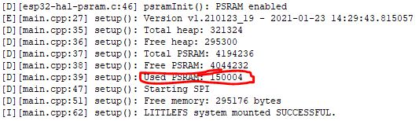
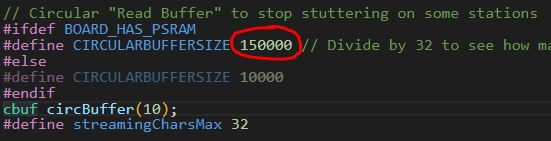

**PLEASE NOTE - if you do not update the Espressif framework as described here, it is unlikely that the circular buffer will be using PSRAM resulting in constant rebooting.**  

To prevent this, and avoid trying to use the PSRAM, change the **main.h** file in the sketch folder and temporarily reduce the circular buffer size to 10000 (10K) bytes from 150000 (150K)**

// Circular "Read Buffer" to stop stuttering on some stations  
// Note: core found in "C:\Users\Ralph\AppData\Local\Arduino15\packages\esp32\hardware\esp32\1.0.6\cores\esp32"  
#ifdef BOARD_HAS_PSRAM  
#define CIRCULARBUFFERSIZE **150000**  <-- change this value to 10000  
#else  
#define CIRCULARBUFFERSIZE 10000  
#endif  

**Now you need to modify the Espressif framework to use the PSRAM - it's just three lines of code**

1. Identify the location of your ESP32 Core library. For me it's:
C:\Users\Ralph\AppData\Local\Arduino15\packages\esp32\hardware\esp32\\**1.0.6**\cores\esp32  
*Note: the version (in bold) will change over time as Espressif updates the framework.*

2. Find the **cbuf.cpp** file, open in Notepad or other text editor, and make these amendments:

  * At the top of the file, under #include "cbuf.h" add the line:  
    **#include "esp32-hal-psram.h"**  
  * Find the **cbuf::resize** function
  * Find the lines:  
    **char \*newbuf = new char[newSize];**  
    **char \*oldbuf = \_buf;**  
  * Replace them with:  
```
// RSB Use PSRAM here if required  
char *newbuf;
#ifdef BOARD_HAS_PSRAM
    newbuf = (char *)ps_malloc(newSize);
#else
#warning "PSRAM not defined or used"
    newbuf = new char[newSize];
#endif

    char *oldbuf = _buf;
```
3. If it makes it easier, grab the modified cbuf.cpp file above and replace your copy (best make a backup first, hey?).

4. Now when you compile, it will allocate the circular buffer in PSRAM (shown on startup in the Serial Monitor).



5. Once you are sure it is using the PSRAM (not SRAM) increase the cbuf value in file main.h to 150000 (150K) and you have a buffer that gives about 10 seconds, more than enough.
  

